# NLP作业三：基于BiLSTM-CRF的命名实体识别

[TOC]

## 一. 任务描述
> **1.1** 训练语料：train.txt为字(符号)序列，train_TAG.txt为对应train.txt中每一个字(符号)的实体标签。例如：
> train.txt第一句：人 民 网 1 月 1 日 讯 据 《 纽 约 时 报 》 报 道 ，
> train_TAG.txt中对位的标签为：O O O B_T I_T I_T I_T O O O B_LOC I_LOC O O O O O O
> 
> **1.2** 发展集dev.txt及其标注dev_TAG.txt（标注规范和train_TAG.txt中的相同），可用于训练过程中进行模型选择。
> 
> **1.3** 测试语料：test.txt：用于测试模型。

## 二. 数据处理

### 2.1 构建词表

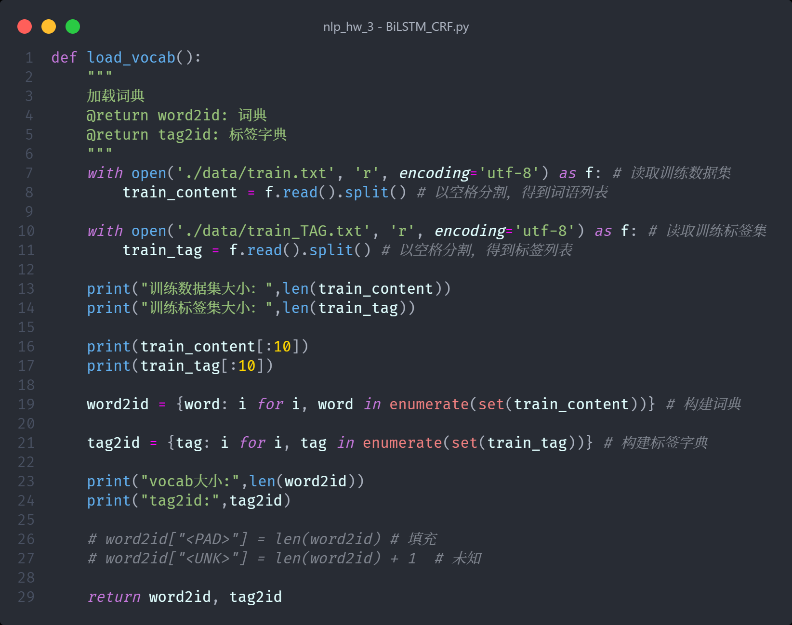

函数 `load_vocab`主要是实现了一个词汇表和标签表的加载。以下是其主要步骤：

1. 打开和读取训练数据集（`train.txt`），将其内容分割成一个个的词，然后存储到变量 `train_content`。

2. 打开和读取训练标签集（`train_TAG.txt`），将其内容分割成一个个的标签，然后存储到变量 `train_tag`。

3. 打印训练数据集和训练标签集的大小以及他们的前十个元素，以便进行检查。

4. 构建一个词典 `word2id`，将 `train_content` 中的每一个独特的词映射到一个独特的ID。

5. 构建一个标签字典 `tag2id`，将 `train_tag` 中的每一个独特的标签映射到一个独特的ID。

6. 打印词典的大小和标签字典，以便进行检查。

7. 该函数最后返回两个字典：词典 `word2id` 和标签字典 `tag2id`。

注释的部分是之前的实现。用到了一个表示填充 ("<PAD>")，另一个表示未知 ("<UNK>") 的词汇。这两个词被用来处理长度不一的句子或未在词汇表中找到的词语。

之前使用mask来处理长度不一的语句。但是这次的任务中，我们使用了padding，所以这部分的代码就不需要了。

###  2.2 处理数据，构建数据集

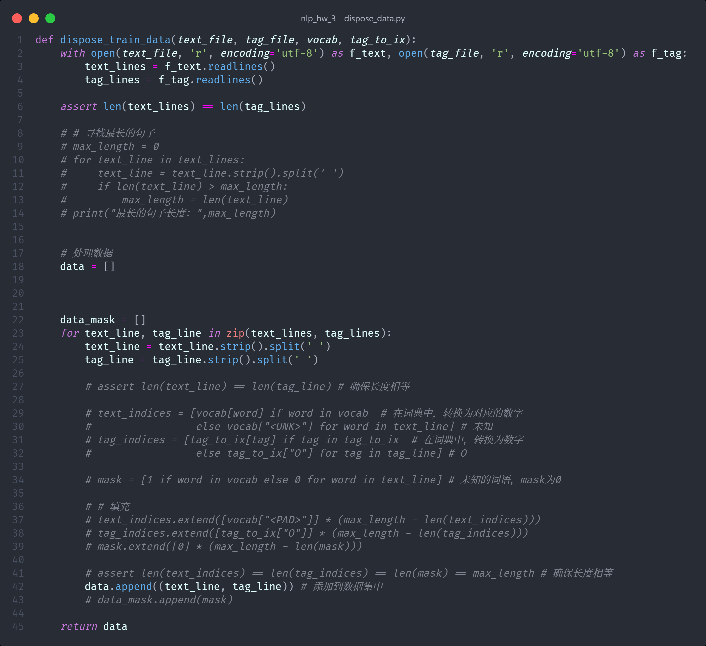

`dispose_train_data`是一个处理训练数据的函数，主要步骤如下：

1. 这个函数接收四个参数：`text_file` 是文本文件路径，`tag_file` 是标签文件路径，`vocab` 是词汇表（即上一个函数 `load_vocab` 的返回值之一），`tag_to_ix` 是标签到索引的映射表。

2. 使用 `with open` 语句打开文本文件和标签文件，并读取它们的所有行。

3. 检查文本文件的行数和标签文件的行数是否相等。如果不相等，则抛出异常。这是为了确保每一行文本对应一行标签。

4. 创建两个空列表 `data` 和 `data_mask`，用于存储处理后的数据。

5. 通过 `zip` 函数将文本行和标签行组合在一起，然后在循环中处理每一对文本行和标签行。

6. 去除每行文本和标签的前后空白，然后使用 `split` 方法将它们分割成词和标签。

7. 将处理后的文本行和标签行作为一个元组添加到 `data` 列表中。

8. 函数最后返回处理后的数据列表 `data`。这个列表的每个元素是一个元组，元组的第一个元素是一个词列表，元组的第二个元素是对应的标签列表。

带有注释的部分是我之前的实现，后被弃用。

## 三. 构建BILSTM-CRF模型

### 3.1 一些辅助函数

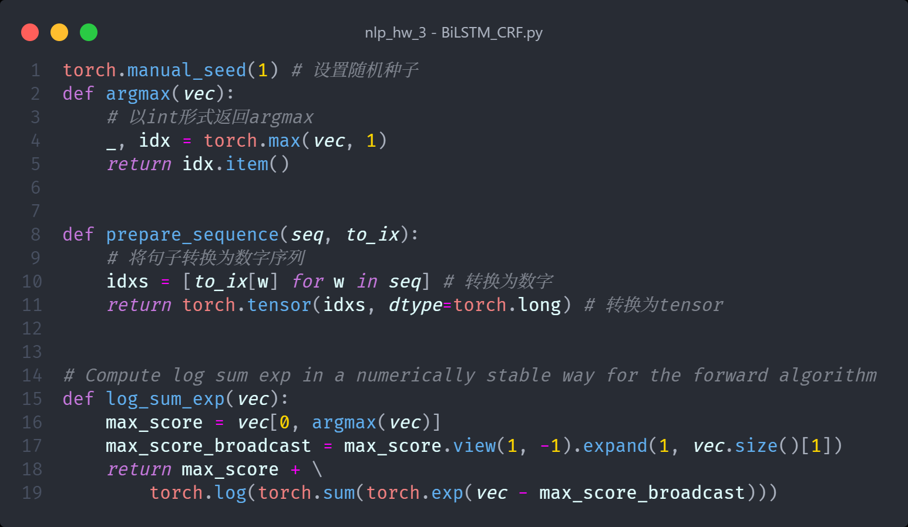

这段代码定义了三个辅助函数：`argmax`，`prepare_sequence`，和`log_sum_exp`，用于处理 PyTorch 张量，并设置了全局的随机种子以保证实验的可重复性。以下是每个函数的简要说明：

1. `torch.manual_seed(1)`：这行代码设置了 PyTorch 的全局随机种子为 1，使得随机过程的结果是可重复的。

2. `argmax(vec)`：这个函数接受一个 PyTorch 张量作为输入，返回该张量中最大值的索引。如果输入张量的形状是多维的，那么该函数只会考虑第一维（即 `dim=1`），并返回一个标量。

3. `prepare_sequence(seq, to_ix)`：这个函数将一个词序列转换为一个数字序列。它首先将每个词映射到一个唯一的索引（这需要一个词到索引的映射字典 `to_ix`），然后将得到的索引列表转换为一个 PyTorch 张量。

4. `log_sum_exp(vec)`：这个函数计算了一种叫做 "log-sum-exp" 的操作。函数首先找到输入张量中的最大值（对数空间），然后从所有元素中减去这个最大值（这样做可以防止数值溢出），接着对结果取指数和求和，最后再取对数。这个函数的结果等同于直接对输入张量取指数、求和、再取对数，但是通过使用 "log-sum-exp trick" 可以提高数值稳定性。即：$$\log(\sum_{i=1}^{n} e^{x_i})$$

### 3.2 理论准备

一般来说，BiLSTM，即双向长短期记忆网络，基本的运算过程可以用下面的公式表示：

我们用$t$表示时间步，用$i$, $f$, $g$, $o$分别表示输入门，遗忘门，候选状态和输出门。对于每个时间步：

1. 输入门$i$:

$$i_t = \sigma(W_{ii}x_t + b_{ii} + W_{hi}h_{t-1} + b_{hi})$$

2. 遗忘门$f$:

$$f_t = \sigma(W_{if}x_t + b_{if} + W_{hf}h_{t-1} + b_{hf})$$

3. 候选状态$g$:

$$g_t = \tanh(W_{ig}x_t + b_{ig} + W_{hg}h_{t-1} + b_{hg})$$

4. 输出门$o$:

$$o_t = \sigma(W_{io}x_t + b_{io} + W_{ho}h_{t-1} + b_{ho})$$

然后，我们可以计算细胞状态$c$和隐藏状态$h$：

5. 细胞状态$c$:

$$c_t = f_t * c_{t-1} + i_t * g_t$$

6. 隐藏状态$h$:

$$h_t = o_t * \tanh(c_t)$$

这些公式描述了一个普通的LSTM。

一个BiLSTM包括两个LSTM，一个正向传播（forward LSTM）和一个反向传播（backward LSTM）。这两个LSTM的输出将会在每个时间步被拼接起来。

### 3.3 构建BILSTM-CRF模型类

#### 3.3.1 初始化函数

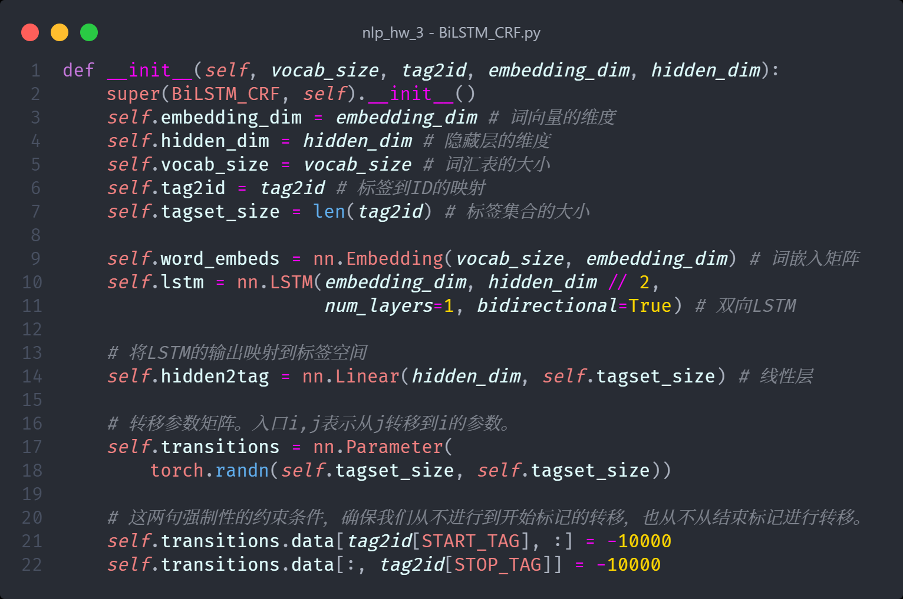

初始化函数`__init__`设置了一个用于命名实体识别的双向LSTM+CRF模型的基本参数和结构。以下是每个参数的简要说明：

1. `self.embedding_dim`，`self.hidden_dim`，`self.vocab_size`和`self.tag2id`存储了该模型的基本参数，分别是词向量的维度，隐藏层的维度，词汇表的大小和标签到ID的映射。

2. `self.tagset_size`是标签集的大小，它等于`tag2id`的长度。

3. `self.word_embeds`是一个词嵌入模块，用于将输入的单词转化为词向量。

4. `self.lstm`是一个双向LSTM模块。这里的`hidden_dim // 2`表示每个方向的LSTM的隐藏状态的大小。

5. `self.hidden2tag`是一个线性映射，将双向LSTM的输出映射到标签空间。

6. `self.transitions`是CRF层中的转移矩阵，其中元素`i,j`表示从标签`j`到标签`i`的转移的得分。这个矩阵是模型需要学习的参数。

7. `self.transitions.data[tag2id[START_TAG], :] = -10000`和`self.transitions.data[:, tag2id[STOP_TAG]] = -10000`是在转移矩阵中设置一些特殊值，以避免从开始标签进行转移，以及避免进行到结束标签的转移。这两个操作强制模型在进行序列标注时从一个特定的开始标签开始，并以一个特定的结束标签结束。

8. `self.hidden = self.init_hidden()`初始化隐藏状态。

总的来说，`__init__`代码建立**一个词嵌入层**，**一个双向LSTM**层和**一个线性映射层**，并设置了一些初始参数，为训练BiLSTM-CRF模型做准备。


#### 3.3.2 初始化隐藏层

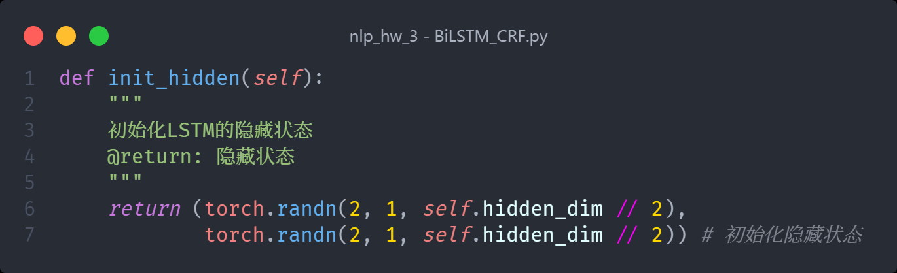

这个`init_hidden`函数是用于初始化LSTM的隐藏状态的。

对于LSTM网络，需要初始化两个隐藏状态：一个是普通的隐藏状态h，一个是细胞状态c。这两个状态都是在每个时间步更新的。

在这个函数中，它返回了一个元组，包含了两个形状为`(2, 1, self.hidden_dim // 2)`的随机张量。这两个张量分别表示了**隐藏状态h**和**细胞状态c**。

其中，`2`代表了两个方向（前向和后向）的LSTM，`1`代表了一个批次大小（这里假设为1，实际使用时可能需要根据输入数据调整），`self.hidden_dim // 2`是每个方向上的隐藏层节点数量。注意，这个隐藏层节点数量是总数的一半，因为这是一个双向LSTM，需要将节点数量分配到两个方向上。

这些随机生成的隐藏状态可以在训练开始时被用作LSTM的初始状态。


#### 3.3.3 条件随机场函数（前向传播的一部分）

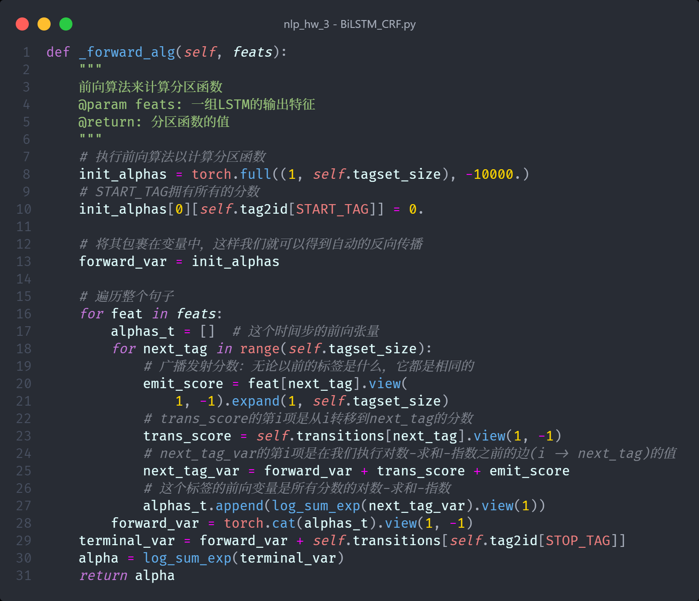

`_forward_alg`函数实现了条件随机场（CRF）模型的前向算法，用来计算所有可能的标签序列的分数总和（又叫做分区函数）。

在这个函数中：

1. 初始化一个`init_alphas`张量，其大小为`(1, self.tagset_size)`，所有元素初始化为-10000，然后将开始标签的位置设为0。这样做的原因是我们希望所有序列都从开始标签开始。

2. 然后在每一个时间步中，计算从每一个可能的前一个标签转移到下一个标签的分数，并加上当前标签的发射分数。这个分数是计算出的`next_tag_var`。

3. 使用`log_sum_exp`函数来稳定地计算所有可能的上一个标签的总分数。这是因为直接计算所有可能情况的和会由于分数差距过大而导致数值不稳定。

4. 在计算完所有时间步之后，将所有可能的序列分数加上从最后一个标签转移到结束标签的转移分数，然后再次使用`log_sum_exp`函数计算最终的分区函数的值。

这个函数的输出是**所有可能标签序列的对数分数总和**，也就是对数形式的分区函数。

其中，`log_sum_exp`函数的主要目的是为了在计算所有可能序列的总分数时，避免直接相加导致的数值不稳定。这个函数的基本公式是：

$$\log(\sum_{i=1}^{n} e^{x_i})$$

这样可以保证在求和的过程中，不会因为某些序列的分数过大而导致其他序列的分数在求和时被忽略。

#### 3.3.4 获取一个句子通过双向LSTM后的输出特征（前向传播的一部分）

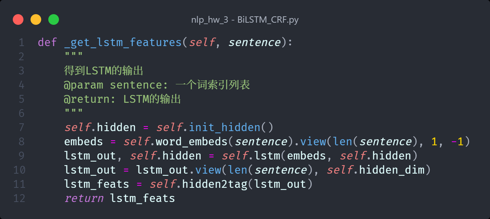

`_get_lstm_features`函数的功能是获取一个句子通过双向LSTM后的输出特征。

具体步骤如下：

1. 首先，使用`init_hidden`函数**初始化**LSTM的隐藏状态。

2. 然后，将句子的每一个词索引输入到`self.word_embeds`中得到相应的词嵌入。这些词嵌入被整合成一个形状为`(len(sentence), 1, -1)`的张量，其中`len(sentence)`是句子的长度。

3. 这个词嵌入张量然后被**传入到双向LST**M中，得到的输出是`lstm_out`，它的形状是`(len(sentence), 1, hidden_dim)`。

4. 将`lstm_out`的形状改为`(len(sentence), self.hidden_dim)`，然后通过`self.hidden2tag`线性层将其映射到标签空间，得到的输出是`lstm_feats`。

这个函数的输出`lstm_feats`就是句子的**每一个词通过双向LSTM和线性映射后得到的特征**，它的形状是`(len(sentence), self.tagset_size)`。这些特征将被用于后面的CRF层来进行标签序列的决策。

#### 3.3.5 对标签序列评分

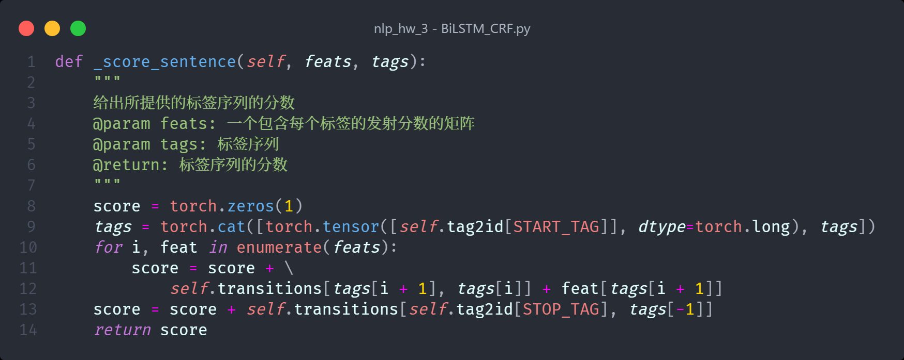

`_score_sentence`函数实现了对一个标签序列的评分。

函数的输入有两个：`feats`是一个包含每个**标签发射分数的矩阵**，`tags`是一个**标签序列**。

具体步骤如下：

1. `score`初始化为0，用于存储整个标签序列的分数。

2. 在`tags`序列前添加了一个开始标签`START_TAG`。

3. 然后对于`feats`的每一个元素，加上从当前标签转移到下一个标签的转移分数和当前标签的发射分数。

4. 在计算完所有元素之后，再加上从最后一个标签转移到结束标签`STOP_TAG`的转移分数。

这个函数的输出是这个**标签序列的分数**，也就是这个标签序列在模型中的对数似然值。这个值越大，表示这个标签序列**越可能是模型的输出**。

#### 3.3.6 维特比算法解码

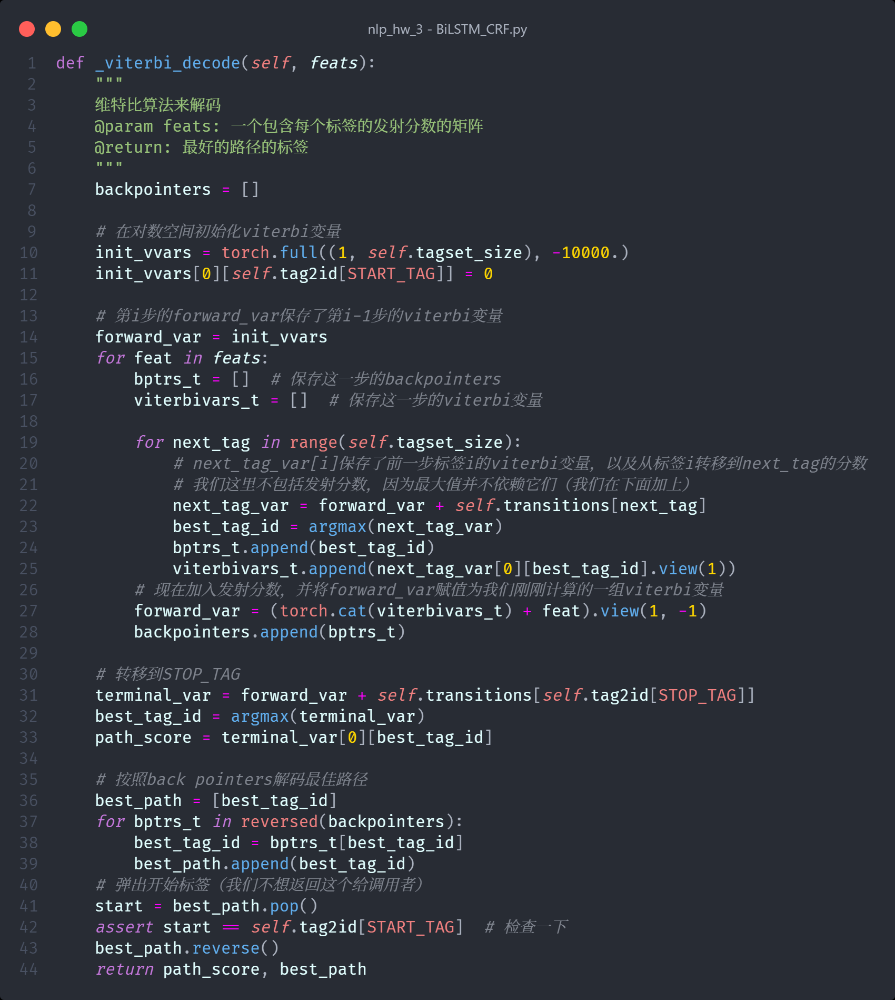

`_viterbi_decode`函数实现了使用**维特比（Viterbi）**算法进行解码的过程，找出模型预测的最佳标签序列。

具体步骤如下：

1. 首先，初始化维特比变量`init_vvars`，其大小为`(1, self.tagset_size)`，所有元素初始化为-10000，然后将开始标签的位置设为0。这样做的原因是我们希望所有序列都从开始标签开始。

2. 对于输入特征`feats`的每一个元素，计算从每一个可能的前一个标签转移到下一个标签的分数，并加上当前标签的发射分数。这个分数是计算出的`next_tag_var`。

3. 使用`argmax`函数找出最大分数对应的标签，这个标签就是在当前时间步最可能的标签。这个标签以及其分数被分别存入`bptrs_t`和`viterbivars_t`。

4. 然后将`viterbivars_t`加上当前时间步的发射分数，作为下一时间步的`forward_var`。

5. 在计算完所有时间步之后，将所有可能的序列分数加上从最后一个标签转移到结束标签的转移分数，然后使用`argmax`函数找出最大分数对应的标签。

6. 最后，根据存储的`backpointers`回溯找出最佳的标签序列。

这个函数的输出是最佳标签序列的分数和这个序列本身。这个序列就是模型预测的最佳标签序列。

#### 3.3.7 计算对数似然损失的函数

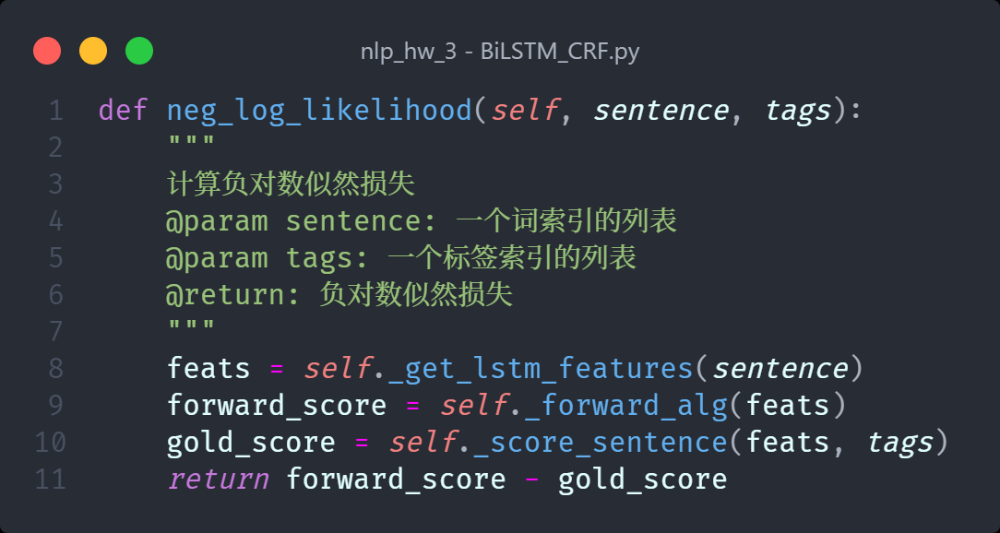

`neg_log_likelihood`函数实现了计算对数似然的过程。

它衡量的是**模型预测**的标签序列和**真实标签**序列之间的差距。

函数的输入是一个词索引列表`sentence`和一个标签索引列表`tags`。

具体步骤如下：

1. 首先，将`sentence`通过`_get_lstm_features`函数得到特征`feats`。

2. 然后，通过`_forward_alg`函数计算得到所有可能的标签序列的总分数`forward_score`，这个过程也称为前向算法。

3. 同时，通过`_score_sentence`函数计算真实标签序列的分数`gold_score`。

这个函数的输出是所有可能的标签序列的总分数减去真实标签序列的分数，即**负对数似然损失**。如果模型预测的结果完全正确，那么这个损失应该为0。反之，如果预测的结果与真实结果相差很远，那么这个损失就会很大。所以我们在训练模型的过程中，希望通过优化算法来最小化这个损失。


#### 3.3.8 正向传播函数（预测时使用）

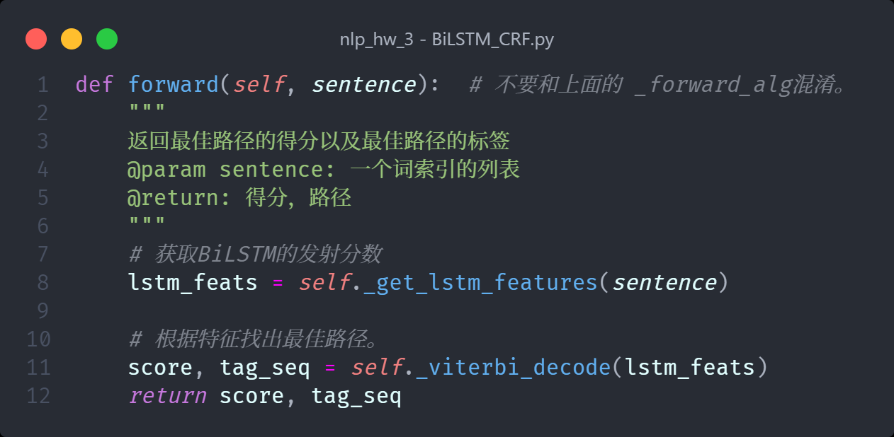

`forward`函数实现了模型的正向传播过程。

函数的输入是一个**词索引列表**`sentence`。

具体步骤如下：

1. 首先，将`sentence`通过`_get_lstm_features`函数得到特征`lstm_feats`。这些特征包括词嵌入和BiLSTM的隐藏状态。

2. 然后，通过`_viterbi_decode`函数找出给定这些特征的条件下，最可能的标签序列`tag_seq`和其对应的分数`score`。

这个函数的输出是**最可能的标签序列的分数**和这个**序列本身**。这个序列就是**模型预测的最佳标签序列**。

在PyTorch中，`forward`方法会在调用`__call__`方法时自动被调用，`__call__`方法通常会在你将输入传递给模型实例时调用。

虽然`forward`方法并未直接调用，但在`neg_log_likelihood`函数中调用了`_get_lstm_features`和`_forward_alg`函数，这两个函数实际上是在`forward`方法中被调用的。

然而，最常见的使用场景是在预测或评估模型的时候，会直接调用`forward`方法。

注意，在实际使用时，我们通常不直接调用`forward`方法，而是调用模型对象（`model(input)`），这种调用方式将触发类的`__call__`方法，`__call__`方法会处理一些前置和后置的操作（如注册钩子、设置梯度跟踪状态等），然后调用`forward`方法。


#### 3.3.9函数调用关系流程图


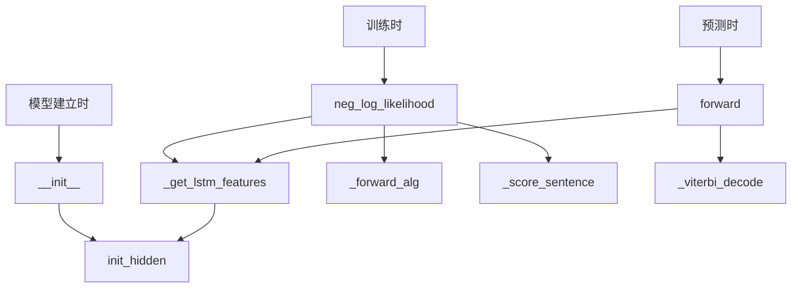
```mermaid
graph TB
    __init__[__init__]
    init_hidden[init_hidden]
    _get_lstm_features[_get_lstm_features]
    _forward_alg[_forward_alg]
    _score_sentence[_score_sentence]
    _viterbi_decode[_viterbi_decode]
    neg_log_likelihood[neg_log_likelihood]
    forward[forward]
    
    __init__-->init_hidden

    模型建立时-->__init__
    训练时-->neg_log_likelihood
    预测时-->forward

    _get_lstm_features-->init_hidden
    neg_log_likelihood-->_get_lstm_features
    forward-->_get_lstm_features
    
    neg_log_likelihood-->_forward_alg
    neg_log_likelihood-->_score_sentence
    
    forward-->_viterbi_decode
```

## 四. 数据准备和模型实例化

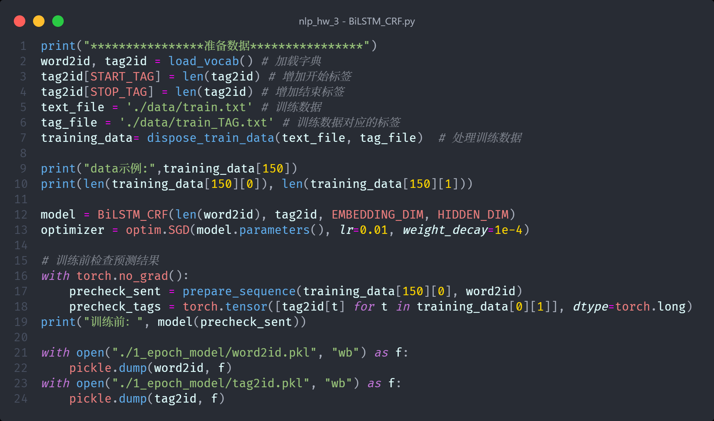

该阶段的主要任务是准备并处理训练数据，然后初始化模型，最后保存数据处理过程中生成的字典(word2id, tag2id)。

以下是各步骤的详细描述：

1. 准备数据: 首先，调用`load_vocab()`加载的词典（word2id，tag2id），然后在标签字典(tag2id)中添加开始和结束标签。之后，调用`dispose_training_data`加载训练数据及其对应的标签，并进行处理。

2. 初始化模型: 初始化模型，并设置优化器为**随机梯度下降SGD**。

3. 检查模型: 在训练前，使用一条训练数据来检查模型的预测结果。

4. 保存字典: 最后，将处理数据时生成的字典（word2id, tag2id）保存起来，以便于后续的使用。

然后一定要保存词汇表`word2id`和标签字典`tag2id`,一开始没有保存的话，每次load数据会重新生成词汇表,**很可能同一个单词已经对应不同的数字**

## 五. 训练模型

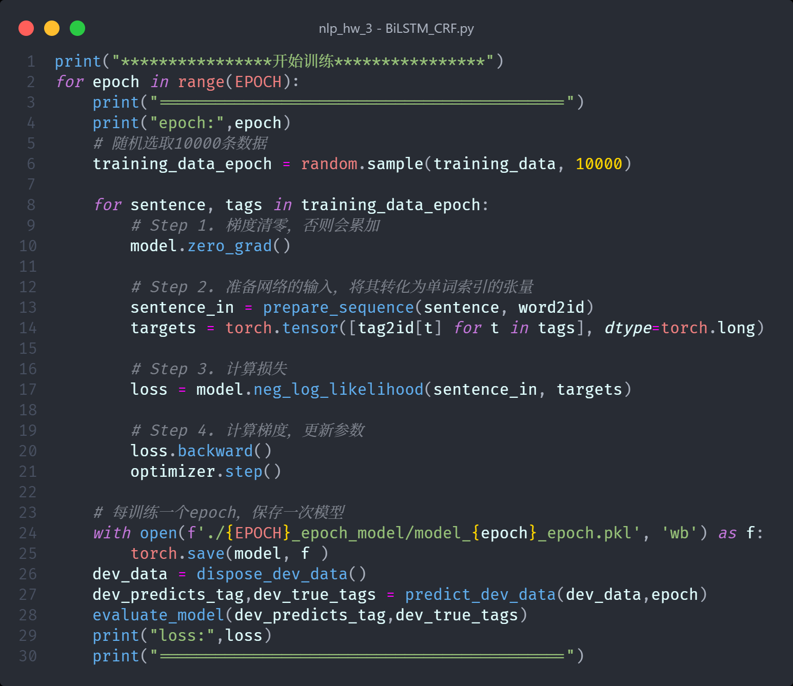


1. 开始训练: 训练过程会进行9/1个周期(epoch)。在每一个周期，随机选择10000条数据进行训练。

2. **清零梯度**: 在训练开始前，先清零模型的梯度。这一步是因为在PyTorch中，梯度是累积的，如果不清零，每一次的梯度就会和之前的梯度累积在一起，会导致训练结果不正确。

3. **准备网络的输入**: 把输入数据和目标数据都转化为模型可以接受的形式，即单词索引的张量。

4. **计算损失**: 利用模型的 `neg_log_likelihood` 方法来计算损失。这个方法会计算真实标签和模型预测标签之间的负对数似然损失。

5. **计算梯度和更新参数**: 利用反向传播算法计算损失的梯度，然后利用优化器更新模型的参数。

6. **保存模型**: 训练完毕后，保存模型到指定的文件中。

在每个epoch结束后，这个过程会被重复，直到达到预设的epoch数量。

我试了下，训练**所有的数据**一个epoch大约需要20个小时，实在是无法完成，于是我随机选择10000条数据进行训练，**训练一个epoch大约需要50分钟。**

**我分别进行了1个epoch到9个epoch的训练**，模型保存在`./model_0_epoch.pkl`到`./model_8_epoch.pkl`中。

## 六. 使用发展集评价模型

### 6.1 处理dev集

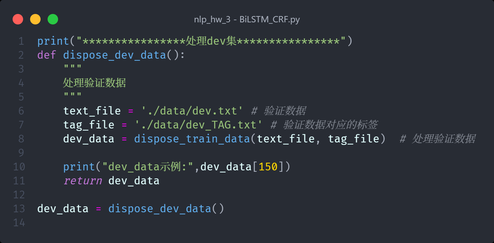


1. 定义了一个函数`dispose_dev_data`，这个函数没有输入参数。

2. 在这个函数中，首先定义了两个文件路径字符串：`text_file`和`tag_file`。`text_file`是验证数据集的路径，`tag_file`是验证数据集对应的标签的路径。

3. 然后，调用了函数`dispose_train_data(text_file, tag_file)`，该函数将`text_file`和`tag_file`作为输入参数，返回处理过的验证数据。

4. 之后，使用`print`函数打印出处理过的验证数据的一个示例，具体打印出的是`dev_data`的第151个元素（Python中的索引是从0开始的，所以索引150对应的是第151个元素）。

5. 最后，函数返回处理过的验证数据`dev_data`。

6. 最后一行`dev_data = dispose_dev_data()`是在全局范围内（也就是在函数外）调用`dispose_dev_data`函数，并将返回的验证数据赋值给`dev_data`。

总的来说，这段代码主要是读取验证数据和对应的标签，对这些数据进行处理，并保存处理后的数据。然后打印出一条示例数据，并将所有处理后的数据返回。

### 6.2 使用dev集进行预测

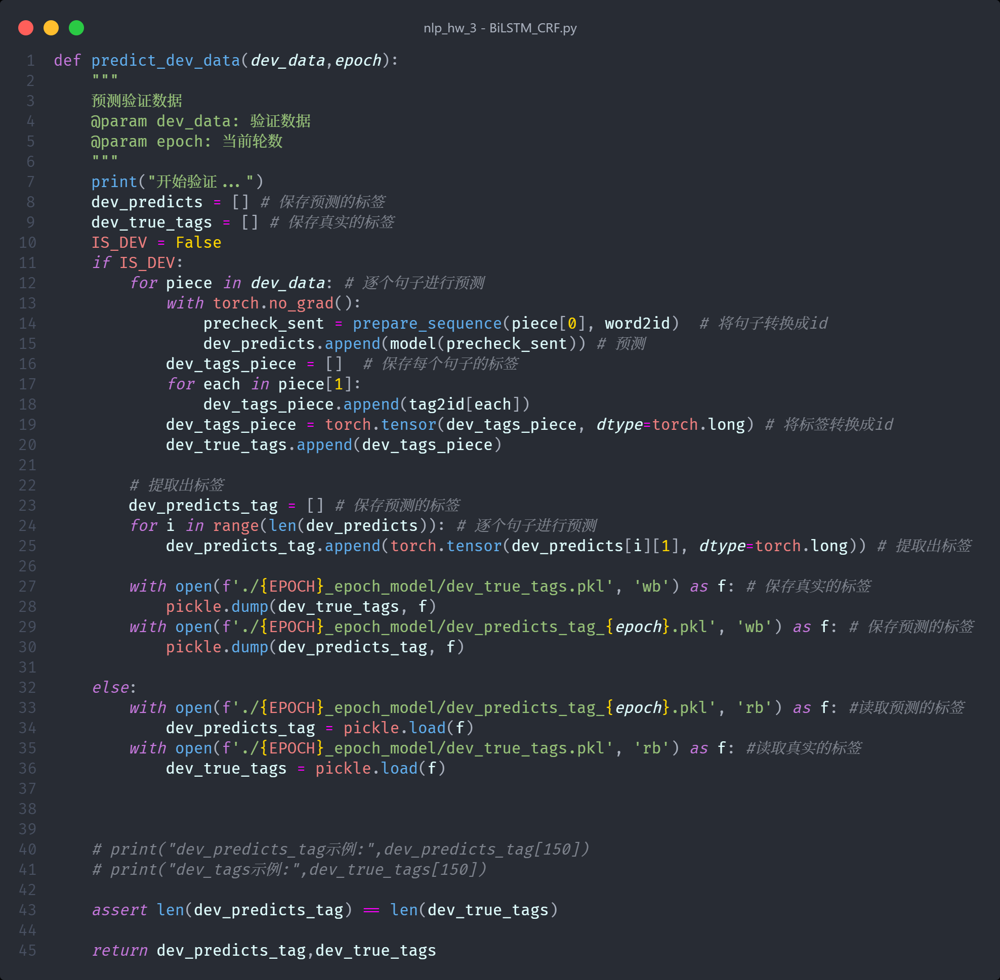

 `predict_dev_data` 的函数，该函数的主要功能是预测验证数据集（dev_data）的结果，并将这些结果与真实的标签进行比较。

下面是函数中各部分的详细解释：

1. 定义函数：该函数以 `dev_data` （用于模型验证的数据）和 `epoch`（训练的迭代次数）为输入。

2. 输出开始验证的提示信息。

3. 定义存放预测结果和真实标签的列表 `dev_predicts` 和 `dev_true_tags`。

4. 设置验证模式 `IS_DEV` 为 True。这是一个布尔型变量，表示是否进行验证。

5. 迭代 `dev_data` 中的每一个样本（在此处表示为 `piece`）：

    - 使用 PyTorch 的 `torch.no_grad()` 函数来禁用梯度计算，这样可以节省计算资源，因为我们在预测阶段不需要计算梯度。

    - 使用 `prepare_sequence` 函数将输入的句子转化为相应的 id，然后将预测结果添加到 `dev_predicts` 列表。

    - 对每个样本的真实标签进行转换，得到对应的 id，然后将这些 id 作为 Tensor 添加到 `dev_true_tags` 列表。

6. 提取出预测结果的标签并存储。

7. 利用 Python 的 `pickle` 模块，将真实的标签和预测的标签存储为 `.pkl` 格式的文件。文件名包含了当前的 epoch。

8. 如果 `IS_DEV` 为 False，那么就直接从 `.pkl` 文件中加载预测的标签和真实的标签。

9. 输出一些预测结果和真实标签的示例，用于对照。

10. 利用 `assert` 确保预测的标签和真实的标签的数量是相同的。这是一个重要的检查，如果数量不相等，程序会抛出异常。

11. 最后，函数返回预测的标签和真实的标签。

总的来说，这个函数的主要任务是利用训练好的模型来对验证集进行预测，并将预测结果与真实结果进行对比，然后将这些结果保存到磁盘上。


### 6.3 评价模型

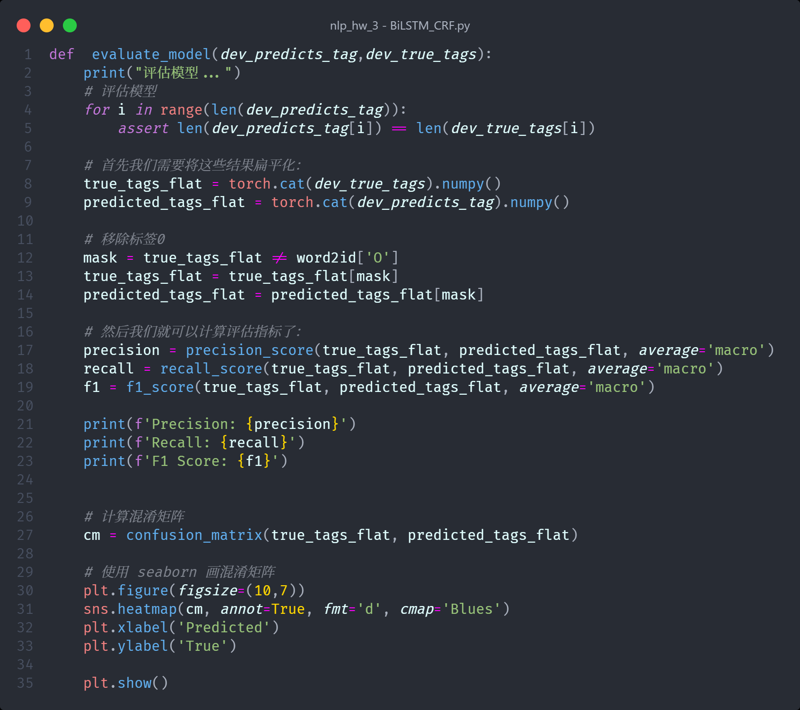

`evaluate_model` 的函数主要用于评估模型的性能。

输入为 `dev_predicts_tag` 和 `dev_true_tags`，分别代表预测的标签和真实的标签。

1. 输出开始评估的提示信息。

2. 通过一个循环，确保每个预测的标签和真实的标签的长度相同。

3. 执行“**扁平化**”操作：将所有的预测标签和真实标签连接成一个长的一维数组。

4. **移除标签为 'O' 的数据**。'O' 标签通常表示该词不属于任何实体。

5. 计算预测结果的精确度（Precision），召回率（Recall）和 F1 值。这些都是常用的分类任务的评估指标。精确度描述了预测为正样本的结果中真正为正样本的比例，召回率描述了所有正样本中被预测为正样本的比例，而 F1 值则是精确度和召回率的调和平均数。

6. 计算混淆矩阵。混淆矩阵是一种常用的分类结果的表示方法，其中行表示真实的类别，列表示预测的类别。

7. 利用 `seaborn` 库画出混淆矩阵。其中 x 轴表示预测的类别，y 轴表示真实的类别。

8. 最后，显示绘制的混淆矩阵。

`dev_predicts_tag`函数的主要任务是根据预测结果和真实结果，评估模型的性能，并通过混淆矩阵直观地展示预测结果和真实结果的关系。

## 七.关于任务说明中提出的问题解答

> ==给出标注集。序列标注的标签集是train_TAG.txt中的所有不同的标签组成的集合，请自行统计获得，标签集是后续训练模型和标注的基础，请注意统计完整。

该问题的解答在我的的`tag2id.txt`文件中

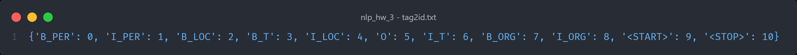

> ==对模型参数和执行细节进行说明。模型参数和执行细节应至少包含：
> 所用初始词向量来源、词向量维数、Bi-LSTM的网络结构参数、训练算法的学习率、训练批次大小、训练轮数等；

1. 初始词向量来源：
   
    词向量是通过一个嵌入层 (`nn.Embedding`) 随机初始化的，然后在训练过程中学习和优化。
    这个嵌入层的初始化发生在 `BiLSTM_CRF` 类的 `__init__` 函数中：

    ```python
    self.word_embeds = nn.Embedding(vocab_size, embedding_dim)
    ```

    其中，`vocab_size` 是词汇表的大小，`embedding_dim` 是词向量的维度。这样，每个词在词汇表中都对应了一个随机初始化的词向量。

    然后，在 `_get_lstm_features` 函数中，我们看到这些词向量被用来生成每个词的嵌入表示：

    ```python
    embeds = self.word_embeds(sentence).view(len(sentence), 1, -1)
    ```
2. Bi-LSTM的网络结构参数：
    397~399行

    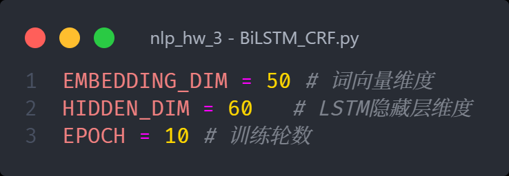

3. 训练算法的学习率：

    0.01 418行
    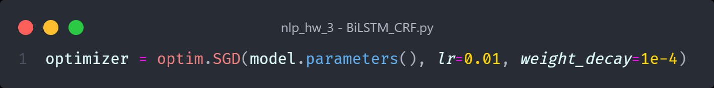

4. 训练批次大小:
    就是batch_size，我每次放进去一个句子，所以是1

5. 训练轮数:
    总共9轮
    见[五. 训练模型](#%E4%BA%94-%E8%AE%AD%E7%BB%83%E6%A8%A1%E5%9E%8B)
> 
> ==给出训练损失和发展集性能随时间变化的曲线：
> 每轮记录训练loss，同时每一轮在发展集上进行测试，获得其标注性能(非O标签的F1值)，从而选择合适的训练轮次，在此训练轮次后的参数作为模型最后参数，用于对test.txt进行标注。

见 8.选取dev集最优模型

## 八.选取dev集最优模型

每一轮在发展集上进行测试，获得其标注性能(非O标签的F1值),从而选取第八个epoch的模型作为最优模型

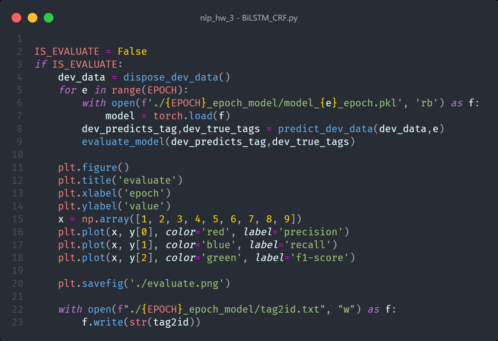

首先，`IS_EVALUATE`这个变量用来控制是否进行评估。当`IS_EVALUATE`设定为True时，将会执行评估的代码。

1. 如果进行评估，首先处理开发集数据，然后加载已经保存的每个训练周期（epoch）的模型，对开发集数据进行预测，并对模型进行评估。

2. 之后，利用Matplotlib库生成一个绘图对象。并设置图表的标题为"evaluate"，x轴标签为"epoch"，y轴标签为"value"。

3. `x`是一个numpy数组，代表了不同的训练周期（epoch）。然后，它使用`plt.plot`函数在同一个图中绘制出精确率（precision）、召回率（recall）和F1得分（f1-score）的变化趋势。`y`是一个包含三个元素的列表，分别代表各个训练周期的精确率、召回率和F1得分。

4. 保存这个图为"evaluate.png"。

下面是运行的效果


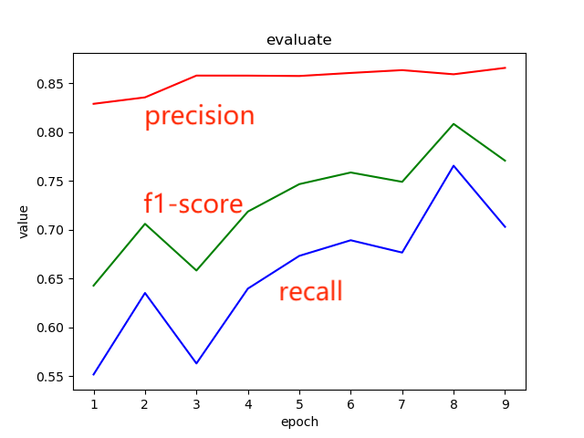

epoch 1

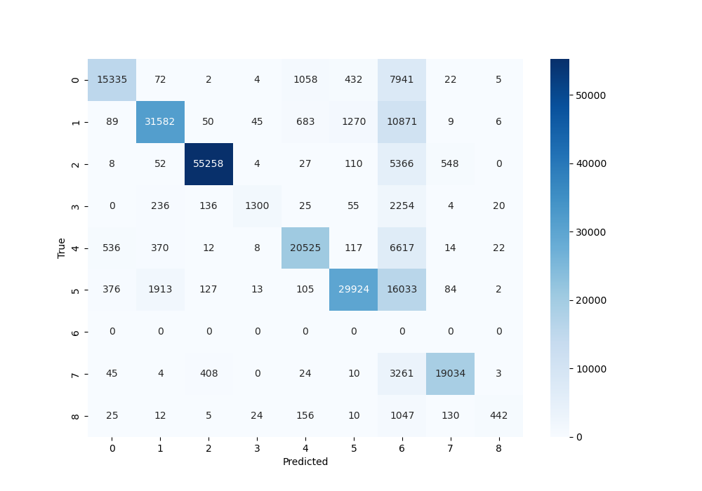 

epoch 2


epoch 3 

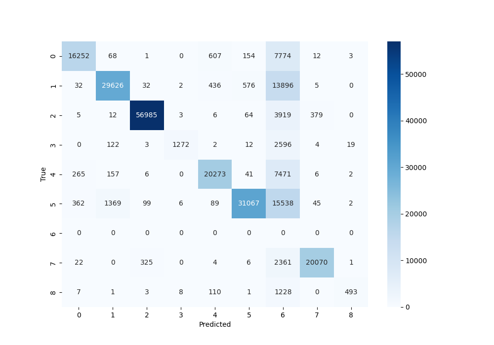

epoch 4


epoch 5 

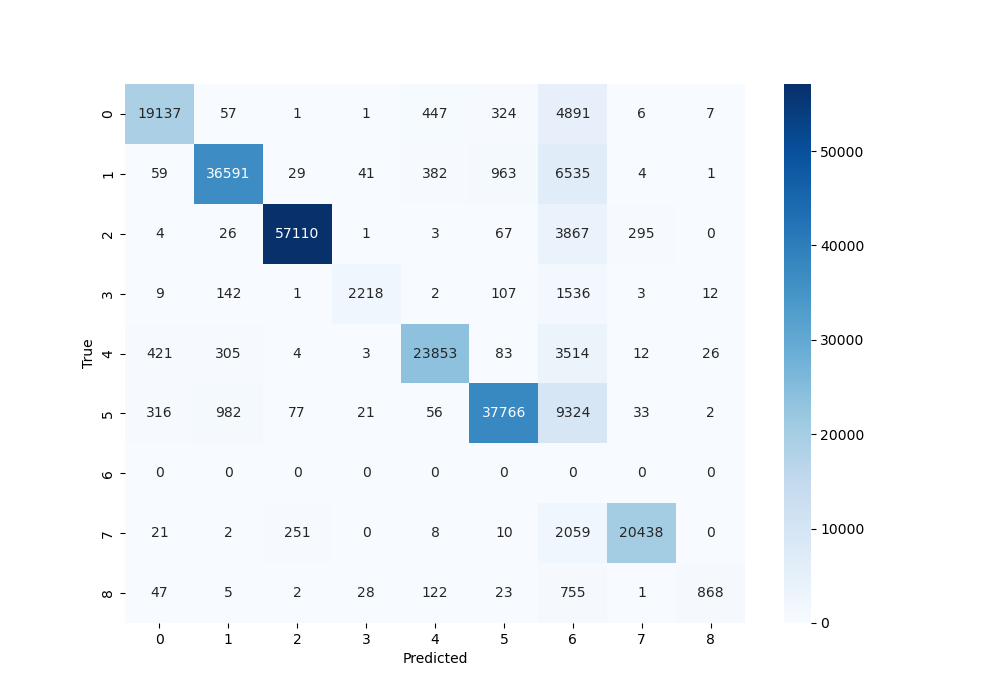

epoch 6 

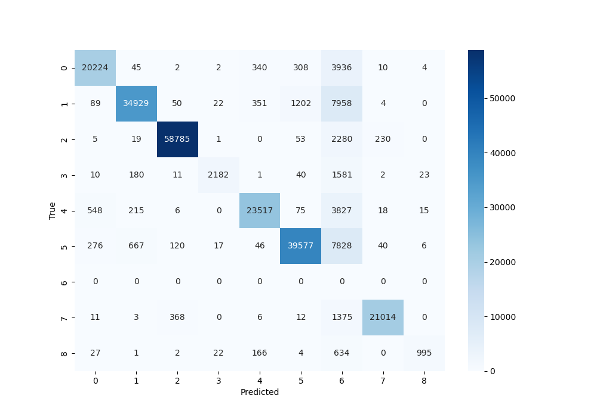

epoch 7

 

epoch 8

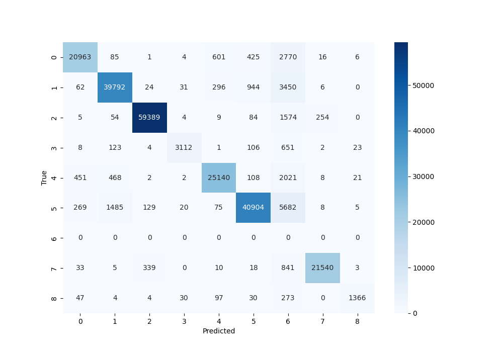

epoch 9 


## 九.对test集进行标注

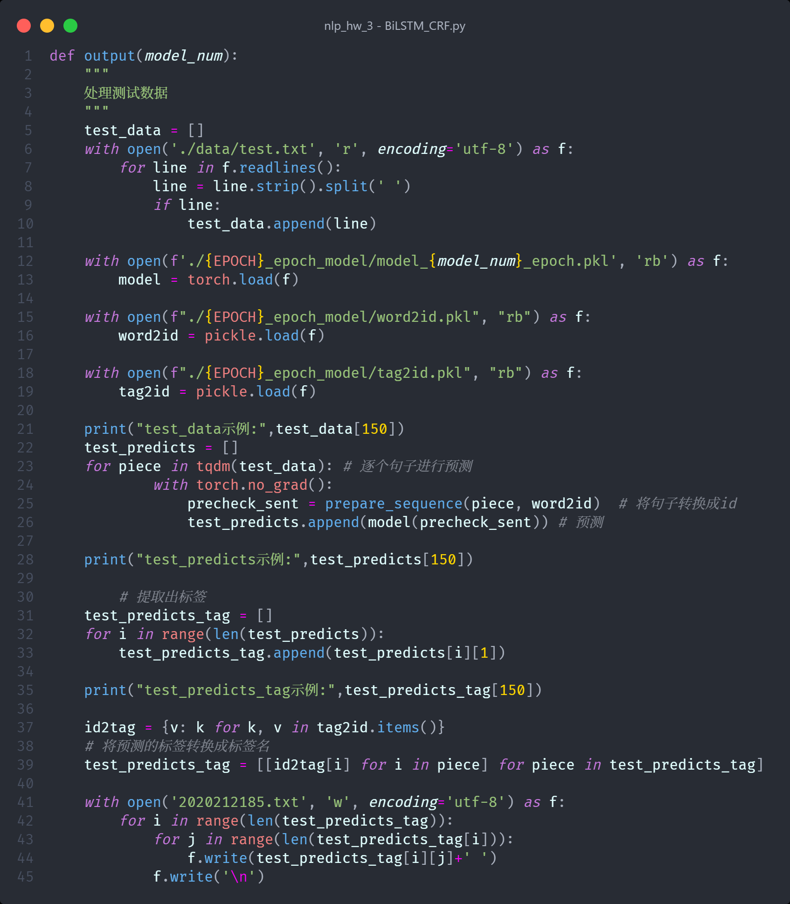

个函数`output`主要用来处理测试数据，并输出模型的预测结果。

这个函数接收一个参数`model_num`，代表要使用哪个训练周期（epoch）的模型进行预测。下面是具体的步骤：

1. 首先，它从"data/test.txt"文件中读取测试数据，并将每行数据拆分为一个词语列表，存储在`test_data`列表中。

2. 然后，它打开预训练模型文件，使用torch库的`load`函数来加载对应`model_num`训练周期的模型。

3. 之后，加载训练阶段保存的`word2id`和`tag2id`映射字典，分别表示单词到id和标签到id的映射。

4. 对于`test_data`中的每个数据（即每句话），用模型进行预测，预测结果存储在`test_predicts`列表中。

5. `test_predicts`是一个包含了每个测试样本的预测结果的列表，每个预测结果包含两个部分，预测标签的得分和预测的标签。提取出预测的标签，存放在`test_predicts_tag`列表中。

6. 将标签id转换回原来的标签名。首先，通过`tag2id`字典，生成一个新的`id2tag`字典，这个字典是`tag2id`的反向映射，即从id到标签的映射。然后，使用这个`id2tag`字典，将`test_predicts_tag`中的所有标签id都转换回原来的标签名。

7. 最后，将`test_predicts_tag`中的所有预测标签写入到"2020212185.txt"文件中，每个标签之间用空格隔开，每行对应一个测试样本的预测结果。

这样，预测结果就写入txt文件中了。

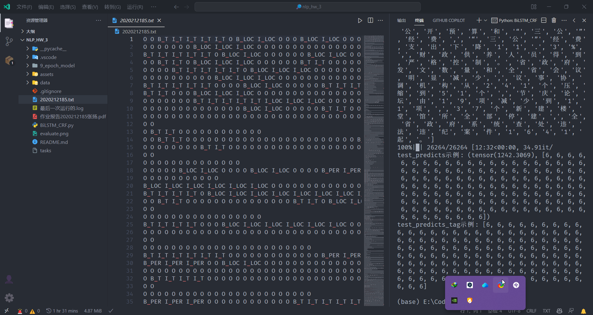

## 十.参考文献


[pytorch官方教程：ADVANCED: MAKING DYNAMIC DECISIONS AND THE BI-LSTM CRF](https://pytorch.org/tutorials/beginner/nlp/advanced_tutorial.html)


